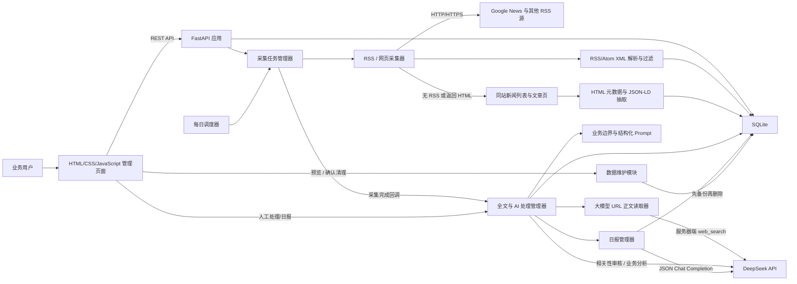
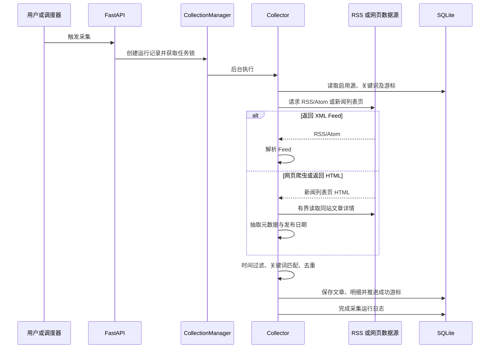
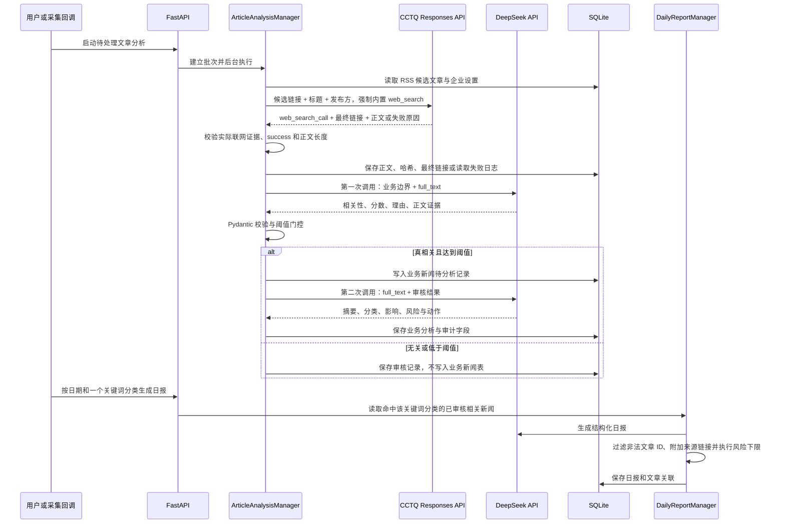

# 系统架构

## 1. 总体结构

当前采用单体架构，Web 接口、调度器和采集器运行在同一个 Python 进程中，适合本地开发和 MVP 验证。

## 2. 模块职责

| 模块 | 文件 | 职责 |
|---|---|---|
| Web/API | `app/main.py` | FastAPI 生命周期、接口、参数校验、静态文件服务 |
| 采集器 | `app/collector.py` | 来源与关键词语言路由、Feed 下载、HTML 爬虫兜底、匹配、时间过滤、去重和入库 |
| 正文读取接口 | `app/content.py` | 文章引用、正文文档、失败分类和外部 URL 安全校验 |
| 数据访问 | `app/database.py` | SQLite 表结构、迁移和数据访问方法 |
| 调度器 | `app/scheduler.py` | 北京时间每日执行和下次执行时间计算 |
| 查询构建 | `app/query_builder.py` | 统一生成查询表达式，并按 `zh-*`/`en-*` 来源切分中英文词组 |
| AI 客户端 | `app/llm.py` | OpenAI 网页读取、DeepSeek JSON 分析、联网证据校验、正文完整性校验和错误处理 |
| Prompt | `app/prompts.py` | 相关性、业务分析与日报的独立 Prompt 及版本 |
| 情报流水线 | `app/intelligence.py` | 全文、相关性门控、业务分析、批次日志和日报持久化 |
| 数据维护 | `app/maintenance.py` | 分层清理预览、运行中保护、SQLite 备份和事务删除 |
| 前端 | `static/` | 采集、AI 情报、日报、配置和日志界面 |
| 测试 | `tests/` | 采集、调度、AI 阈值、风险和日报测试 |

## 3. 采集数据流

## 4. AI 情报数据流

## 5. 数据模型

| 表 | 用途 |
|---|---|
| `rss_sources` | RSS/网页数据源配置、类型、语言、爬虫标记和启用状态 |
| `keyword_categories` | 关键词分类、排序与启用状态；分类日报按其筛选文章 |
| `keywords` | 所属关键词分类、关键词组、查询表达式、主题词、业务信号词、排除词、回溯天数和本地主题校验开关 |
| `articles` | 新闻标题、链接、发布方、摘要和发布时间 |
| `article_sources` | 文章的全部 RSS 来源、链接、GUID、语言、国家、分类及发现时间 |
| `article_keywords` | 文章与命中关键词组的多对多关系 |
| `collection_cursors` | 每个源和关键词组合的上次成功时间 |
| `collection_runs` | 一次手动或定时采集的汇总日志 |
| `collection_run_details` | 每个源和关键词组合的采集明细 |
| `ai_analysis_runs` | AI 分析批次、状态、模型、Prompt 版本和 Token 用量 |
| `ai_analysis_run_items` | 批次内每篇文章的全文、相关性和业务分析阶段状态 |
| `article_contents` | 出版社最终链接、正文、哈希、错误分类、尝试次数、退避时间、最终失败与忽略状态 |
| `article_relevance_reviews` | 基于正文的相关性结果、理由、证据与调用审计字段 |
| `business_articles` | 只保存真相关文章的摘要、分类、影响、风险和建议动作 |
| `article_analyses` | 旧版兼容表；新流水线不再读取其结果 |
| `daily_reports` | 按日期和关键词分类分别生成的日报正文、风险、结构化列表和飞书推送状态 |
| `daily_report_articles` | 日报与其依据文章的多对多关系 |
| `app_settings` | 调度时间、时区、业务边界、阈值、批量大小及日报/飞书自动化开关 |

## 6. 关键设计

### 增量与失败恢复

游标只在对应任务成功后推进。某个数据源请求、Feed 解析或网页抽取失败不会影响其他组合，也不会造成该组合采集范围丢失。

### 去重

系统先清理 URL 中的常见跟踪参数，再以规范化 URL 去重；同时计算“标题 + 发布方 + 发布日期”的 SHA-256 指纹，处理同一新闻使用不同跟踪链接的情况。

文章主记录去重后，每次命中的 RSS 来源仍写入 `article_sources`。因此同一文章来自多个 Feed 时只产生一篇文章，但不会丢失来源证据。发布方经过 Unicode NFKC、空白和边界符号规范化；时间统一保存为 UTC，分类统一保存为 JSON 数组。

### 并发控制

`CollectionManager` 使用进程内锁保证同一时间只有一个采集任务。当前设计要求使用单个 Uvicorn worker；多进程部署前需要改为数据库锁或分布式锁。

### 时区

业务时间使用 `Asia/Shanghai`，数据库时间统一保存为 UTC ISO 8601 字符串，展示时再转换为本地时间。

### AI 可信边界

原始 RSS 候选文章始终保留。正文、相关性审核和最终业务新闻分别写入独立表；全文失败时不允许退回标题或 RSS 摘要进行审核。模型输出必须通过 Pydantic 结构校验，相关性还要通过可配置阈值，只有 `business_articles.analysis_status=success` 的记录才能进入日报。每份日报再通过 `article_keywords → keywords.category_id` 限定为一个关键词分类；AI 业务分类只作为条目标签。Prompt 明确忽略新闻正文中的指令，所有判断只能使用输入证据。日报引用的文章 ID 必须属于本次输入，后端依据有效 ID 附加来源链接，风险分数还执行确定性的文章最高风险下限。

### 有界重试与数据维护

全文读取错误由 `ContentFetchError` 分类为 OpenAI 网络/HTTP、搜索服务不可用、未实际联网、单篇网页不可用、正文不完整或响应格式错误。瞬时错误跨任务按指数退避并最多尝试 3 次；首次 OpenAI HTTP 429 或网页搜索调用失败触发来源级熔断，当前批次停止，未开始的文章保持待办。达到上限的错误进入最终失败，已忽略记录不再进入待办。候选排序优先处理尚未读取的新文章，再处理后续 AI 阶段，最后处理到期重试。

`CleanupService` 是清理能力的唯一接口：同一套范围规则同时用于预览和执行；执行要求确认词、检查三个任务管理器均空闲，并使用 SQLite Online Backup 生成恢复副本后才删除数据。

## 7. 生产化演进

建议将系统拆分为 API、任务队列 worker、调度服务和 PostgreSQL。通过 Redis/Celery、RQ 或同类成熟方案处理重试、并发和任务状态，并在 API 前增加身份认证、HTTPS、访问日志和监控告警。
