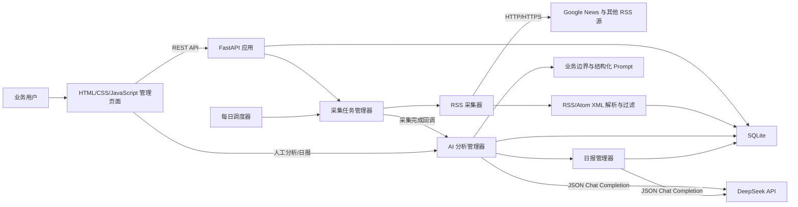
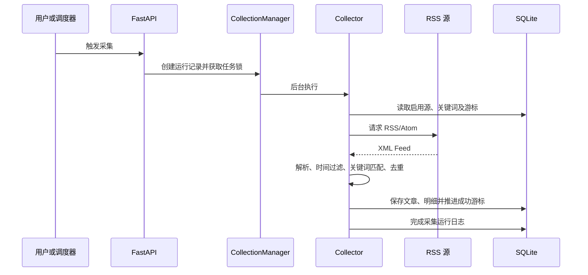
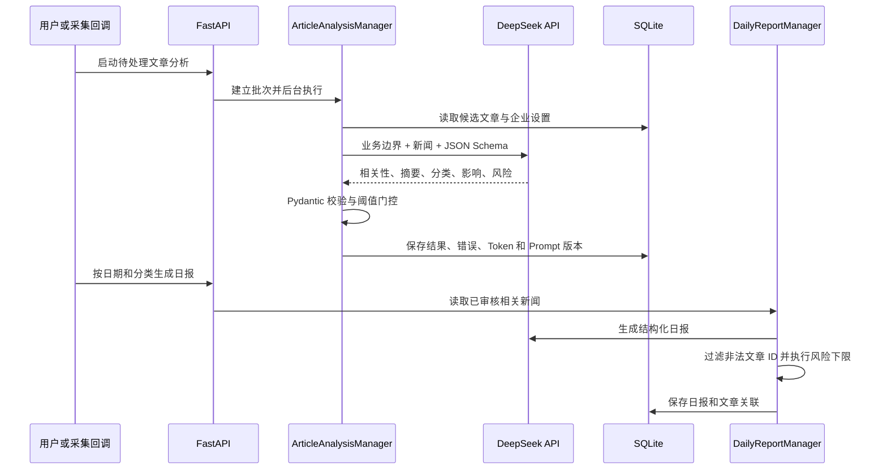

# 系统架构

## 1. 总体结构

当前采用单体架构，Web 接口、调度器和采集器运行在同一个 Python 进程中，适合本地开发和 MVP 验证。

## 2. 模块职责

| 模块 | 文件 | 职责 |
|---|---|---|
| Web/API | `app/main.py` | FastAPI 生命周期、接口、参数校验、静态文件服务 |
| 采集器 | `app/collector.py` | Feed 下载、解析、匹配、时间过滤、去重和入库 |
| 数据访问 | `app/database.py` | SQLite 表结构、迁移和数据访问方法 |
| 调度器 | `app/scheduler.py` | 北京时间每日执行和下次执行时间计算 |
| 查询构建 | `app/query_builder.py` | 将匹配词转换为 Google News 查询表达式 |
| DeepSeek 客户端 | `app/llm.py` | API 鉴权、JSON 请求、响应和错误处理 |
| Prompt | `app/prompts.py` | 企业边界、分类、相关性与日报 Prompt 版本 |
| 情报流水线 | `app/intelligence.py` | AI 批次、结果校验、风险规则和日报持久化 |
| 前端 | `static/` | 采集、AI 情报、日报、配置和日志界面 |
| 测试 | `tests/` | 采集、调度、AI 阈值、风险和日报测试 |

## 3. 采集数据流

## 4. AI 情报数据流

## 5. 数据模型

| 表 | 用途 |
|---|---|
| `rss_sources` | RSS 源配置、类型、语言和启用状态 |
| `keywords` | 关键词组、查询表达式和正文匹配词 |
| `articles` | 新闻标题、链接、发布方、摘要和发布时间 |
| `article_sources` | 文章的全部 RSS 来源、链接、GUID、语言、国家、分类及发现时间 |
| `article_keywords` | 文章与命中关键词组的多对多关系 |
| `collection_cursors` | 每个源和关键词组合的上次成功时间 |
| `collection_runs` | 一次手动或定时采集的汇总日志 |
| `collection_run_details` | 每个源和关键词组合的采集明细 |
| `ai_analysis_runs` | AI 分析批次、状态、模型、Prompt 版本和 Token 用量 |
| `ai_analysis_run_items` | 批次内每篇文章的执行状态与相关性结果 |
| `article_analyses` | 文章相关性、摘要、分类、影响、风险和审计字段 |
| `daily_reports` | 按日期和分类生成的日报正文、风险和结构化列表 |
| `daily_report_articles` | 日报与其依据文章的多对多关系 |
| `app_settings` | 调度时间、时区和上次调度日期 |

## 6. 关键设计

### 增量与失败恢复

游标只在对应任务成功后推进。某个 RSS 源请求或解析失败不会影响其他组合，也不会造成该组合采集范围丢失。

### 去重

系统先清理 URL 中的常见跟踪参数，再以规范化 URL 去重；同时计算“标题 + 发布方 + 发布日期”的 SHA-256 指纹，处理同一新闻使用不同跟踪链接的情况。

文章主记录去重后，每次命中的 RSS 来源仍写入 `article_sources`。因此同一文章来自多个 Feed 时只产生一篇文章，但不会丢失来源证据。发布方经过 Unicode NFKC、空白和边界符号规范化；时间统一保存为 UTC，分类统一保存为 JSON 数组。

### 并发控制

`CollectionManager` 使用进程内锁保证同一时间只有一个采集任务。当前设计要求使用单个 Uvicorn worker；多进程部署前需要改为数据库锁或分布式锁。

### 时区

业务时间使用 `Asia/Shanghai`，数据库时间统一保存为 UTC ISO 8601 字符串，展示时再转换为本地时间。

### AI 可信边界

原始候选文章始终保留，AI 结果写入独立表。模型输出必须通过 Pydantic 结构校验；相关性还要通过可配置阈值，未通过的文章不能进入日报。Prompt 明确忽略新闻正文中的指令，所有判断只能使用输入证据。日报引用的文章 ID 必须属于本次输入，风险分数还执行确定性的文章最高风险下限。

## 7. 生产化演进

建议将系统拆分为 API、任务队列 worker、调度服务和 PostgreSQL。通过 Redis/Celery、RQ 或同类成熟方案处理重试、并发和任务状态，并在 API 前增加身份认证、HTTPS、访问日志和监控告警。
