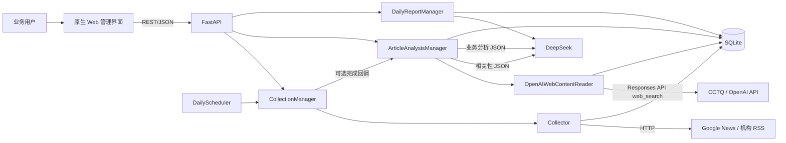
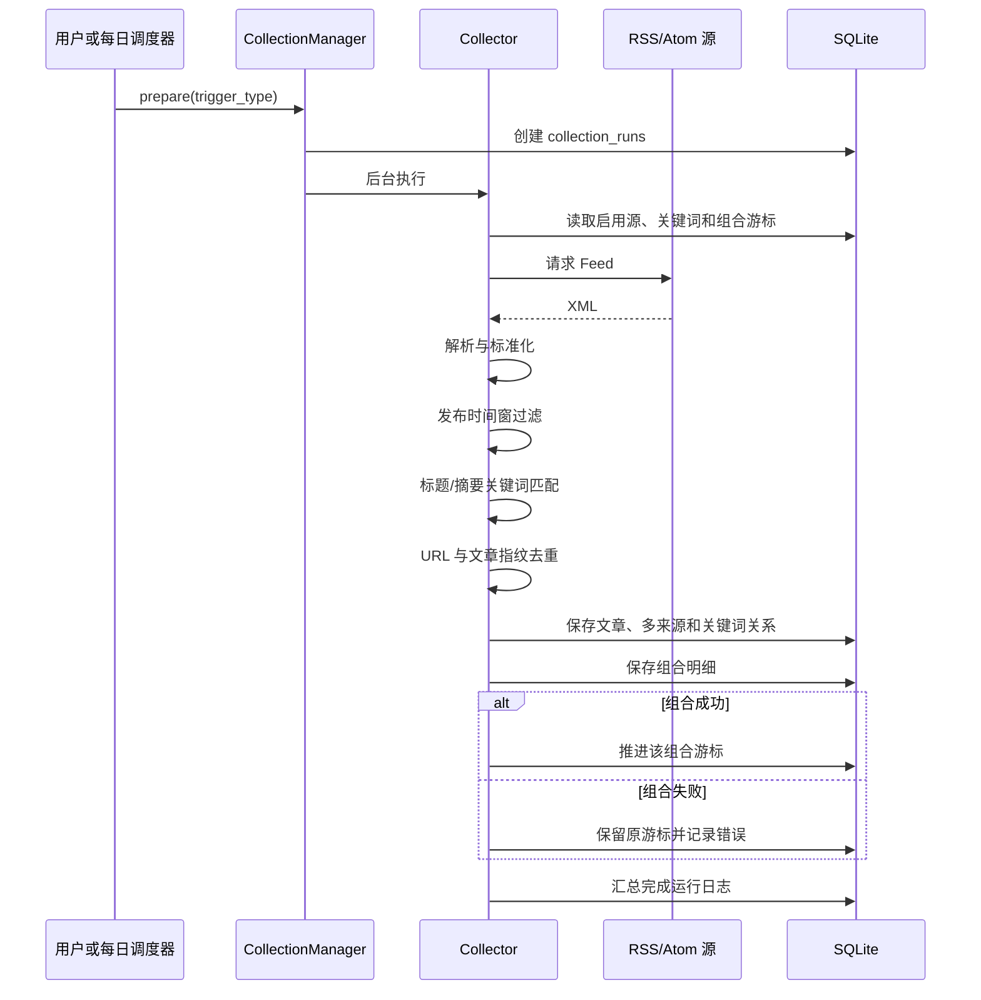
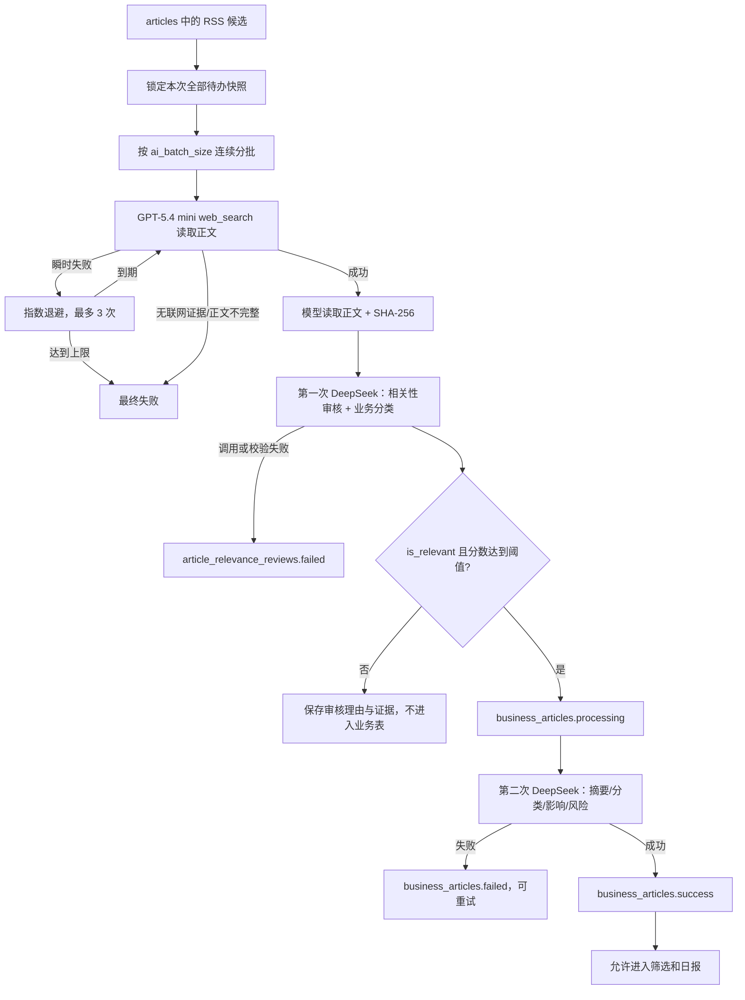
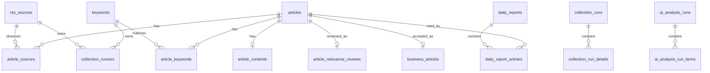
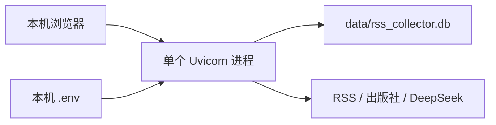
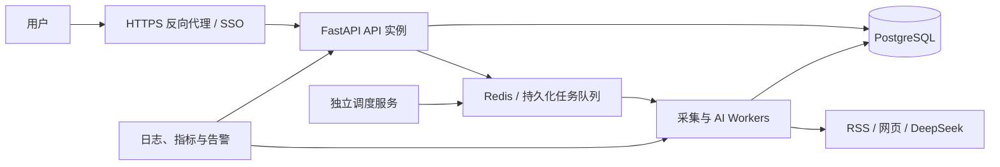

# 英科医疗 RSS 情报系统技术设计说明

## 1. 文档目的

本文档说明系统的业务目标、技术栈、总体架构、数据流转、数据模型、核心规则、技术选型理由、安全边界、部署约束和后续演进方向，供开发、测试、运维和业务团队共同评审与协作。

当前系统定位为可在 Windows + VS Code 环境直接运行的 MVP：先以较低部署成本验证“RSS 候选采集、网页全文获取、AI 相关性审核、业务分析、日报生成”的完整闭环，再根据数据量、并发和团队使用范围逐步服务化。

## 2. 业务目标与系统边界

### 2.1 业务目标

- 持续采集一次性手套、医疗耗材、康复护理、原材料、市场、竞品、法规、贸易和公共卫生等信息。
- 允许业务人员维护 RSS 源和关键词组，不把搜索规则写死在代码中。
- 通过独立增量游标避免重复抓取，同时保证失败任务不会丢失采集时间窗。
- 将“命中关键词的候选新闻”和“与英科医疗业务真正相关的新闻”分层保存。
- 使用网页正文而不是 RSS 标题或摘要进行 AI 相关性判断。
- 对真相关文章生成摘要、分类、影响、风险、机会和建议动作。
- 按发布日期和分类生成可追溯的情报日报。

### 2.2 当前范围

已实现：

- RSS/Atom 搜索型与直连型源管理。
- 关键词组管理与 Google News 查询表达式自动生成。
- 每日定时采集与手动采集。
- 增量时间窗、失败恢复、URL/指纹去重和多来源追踪。
- CCTQ 的 GPT-5.4 mini 通过 OpenAI Responses API 兼容接口和内置网页搜索直接读取并保存新闻正文。
- DeepSeek 两阶段处理：相关性审核、业务情报分析。
- AI 批次日志、阶段状态、Token 和 Prompt 版本记录。
- 按日期和分类生成及保存日报。
- 桌面与移动端管理页面。

暂不属于当前 MVP：

- 多用户账号、角色权限和单点登录。
- 历史任意日期范围补采。
- 邮件、企业微信、钉钉等推送渠道。
- OpenAI 网页搜索无法读取的登录墙、付费墙和受限网页兜底。
- 分布式任务队列、多实例调度和高可用数据库。

## 3. 技术栈与选型理由

| 层级 | 技术 | 当前用途 | 选型理由 |
|---|---|---|---|
| 运行时 | Python 3.12 | 后端、采集、调度、AI 调用和测试 | 团队上手成本低，RSS、文本处理和 AI 生态成熟；3.12 具备较好的性能、类型能力和长期可维护性 |
| Web 框架 | FastAPI | REST API、生命周期、静态文件服务 | 基于类型注解自动校验请求，自动生成 OpenAPI，适合快速构建内部 API，同时保留后续前后端分离能力 |
| 数据校验 | Pydantic | API 入参和模型 JSON 输出校验 | 统一处理枚举、长度、范围和结构约束，避免未经验证的 LLM 输出直接进入数据库 |
| Web 服务器 | Uvicorn | 本地 ASGI 服务 | 与 FastAPI 原生配合，开发启动简单，满足当前单进程 MVP |
| 数据库 | SQLite | 配置、文章、游标、日志、AI 结果和日报 | 无需独立数据库服务，便于本地开发和演示；事务足以支持当前低并发单机工作流 |
| RSS 解析 | Python 标准库 ElementTree | RSS 2.0 和 Atom XML 解析 | 当前 Feed 字段有限，标准库可控且减少依赖；解析逻辑可以直接兼容不同命名空间 |
| 网络请求 | Python 标准库 urllib | Feed、OpenAI 和 DeepSeek HTTP 请求 | 当前请求模式简单，避免再引入 HTTP 客户端依赖；项目不直接请求新闻网页 |
| 正文读取 | CCTQ Responses API + `gpt-5.4-mini` + `web_search` | 服务器端打开候选链接并返回正文 | 使用已验证能转发内置网页搜索的低成本模型；项目校验 `web_search_call`、成功标记、正文长度和最终 URL |
| 大模型 | DeepSeek JSON Chat Completion | 相关性审核、业务分析和日报 | 支持结构化 JSON 输出，便于通过 Pydantic 强约束；模型名、地址和超时可用环境变量替换 |
| 前端 | HTML、CSS、原生 JavaScript | 管理界面、筛选、日志和设置 | 当前页面规模较小，无需构建链和 Node 运行时，克隆后即可启动；减少 MVP 的依赖与部署复杂度 |
| 图标 | Lucide | 操作按钮和导航图标 | 图标语义一致，避免维护手写 SVG |
| 测试 | pytest | 采集、调度、正文、AI 门控和日报测试 | Python 生态成熟，fixture 和临时目录适合测试 SQLite 及依赖注入 |
| 配置 | python-dotenv | 读取 `.env` 中的 OpenAI 与 DeepSeek 配置 | 将密钥与代码、数据库分离，便于每位开发者使用独立本地配置 |

### 3.1 为什么当前不使用 PostgreSQL

SQLite 能让团队在没有额外服务的情况下直接运行项目，适合当前单机、低并发、MVP 验证阶段。其限制是写并发能力、在线迁移、备份治理和多实例协作较弱。当出现多用户同时操作、任务 worker 并发或数据量显著增长时，应迁移到 PostgreSQL。

### 3.2 为什么当前不使用 Celery、Redis 或消息队列

当前采集和 AI 任务由单个 Web 进程内的后台线程执行，调度量较小。立即引入消息队列会增加部署和排障成本。生产化时必须把采集、全文读取和 AI 调用迁移到独立 worker，并使用持久化队列提供重试、超时、并发控制和任务可观测性。

### 3.3 为什么采用两次模型调用

相关性审核和业务分析具有不同目标。如果一次调用同时要求模型判断相关性、摘要、分类和风险，模型容易在关键词误命中文章上继续生成看似合理的分析。拆分后，第一次调用只负责门控；只有通过阈值的文章才发生第二次调用，从数据边界和调用成本两个方面减少无关分析。

## 4. 总体架构



当前是模块化单体架构。模块边界已经按“API、采集、正文、AI、调度、数据库”拆分，便于后续把耗时任务迁移到独立 worker，而不需要先重写业务规则。

## 5. 代码模块与职责

| 路径 | 主要职责 |
|---|---|
| `app/main.py` | FastAPI 应用创建、生命周期、REST 接口、参数校验、后台任务启动和静态文件服务 |
| `app/database.py` | SQLite Schema、兼容迁移、默认配置和基础数据访问 |
| `app/collector.py` | Feed 请求、RSS/Atom 解析、时间窗过滤、关键词匹配、去重和采集日志 |
| `app/query_builder.py` | 统一生成主题词、业务信号、排除词和回溯窗口组成的 Google News 查询表达式 |
| `app/normalization.py` | 发布方、分类和国家字段规范化 |
| `app/scheduler.py` | Asia/Shanghai 每日调度和下次运行时间计算 |
| `app/content.py` | 正文读取接口、文章引用、正文文档、错误分类和 URL 安全校验 |
| `app/llm.py` | OpenAI Responses API 网页读取、DeepSeek JSON 对话、联网证据与正文完整性校验 |
| `app/prompts.py` | 企业业务边界、相关性 Prompt、业务分析 Prompt 和日报 Prompt |
| `app/intelligence.py` | 三阶段处理状态机、阈值门控、业务结果、风险规则和日报持久化 |
| `app/maintenance.py` | 清理范围预览、运行中保护、SQLite 备份和删除事务 |
| `static/index.html` | 页面语义结构和对话框 |
| `static/app.js` | API 调用、状态管理、筛选、分页和页面交互 |
| `static/styles.css` | 桌面、平板和移动端响应式样式 |
| `tests/` | 采集、调度、正文解析、相关性门控、业务分析和日报回归测试 |

## 6. 数据流转

### 6.1 配置到查询表达式

1. 业务人员新增或修改关键词策略，分别填写主题词、业务信号词、排除词和回溯天数。
2. 前端调用 `/api/keywords/preview`，由后端实时返回查询表达式。
3. 保存时后端再次调用 `build_keyword_query()`，不接受客户端自由查询内容。
4. 表达式格式为 `("主题1" OR "主题2") AND ("信号1" OR "信号2") -"噪声" when:30d`。组内是 `OR`，主题组与业务信号组之间使用显式 `AND`。
5. 采集器根据来源的 `language` 切片主题词、业务信号词和排除词：`zh-*` 使用中文词，`en-*` 使用英文词；缺少对应语言主题词时跳过该组合，混合词组分别生成两种查询。
6. Google News 对超长复合查询处理不稳定，查询模块将表达式限制为 200 字符；超过时要求拆成多个更聚焦的关键词组。
7. 搜索型 RSS 源把来源专用表达式 URL 编码后替换到 `{query}`；直连型 RSS 源使用固定地址，但仅用同语言关键词匹配内容。

这样可以保证“页面显示、数据库保存、实际请求”使用同一套规则，避免客户端篡改或版本不一致。

### 6.2 RSS 增量采集流



时间窗规则：

- 新关键词首次采集：从其配置的北京时间回溯窗口起点至本次任务开始时间。
- 后续采集：该“RSS 源 × 关键词组”上次成功时间至本次任务开始时间。
- 若上次成功游标早于静态回溯窗口，运行时 Google News 查询会自动扩大 `when:Nd`，避免失败恢复时搜索范围小于数据库时间窗。
- 只有组合成功时才推进对应游标。
- 任务启动时间在开始时固定，执行过程中出现的新文章留给下一次采集，避免时间边界漂移。

### 6.3 正文与 AI 处理流



关键约束：

- RSS 标题和摘要只用于候选匹配，不用于 AI 最终判断。
- 一次手动点击或自动分析会锁定启动时的全部待办，按批次连续运行，无需用户重复触发。
- 普通单篇失败不阻断后续文章；OpenAI 网页读取 HTTP 429 或网页搜索调用失败属于来源级故障，会暂停当前队列。瞬时全文错误跨任务按 5、10 分钟退避，最多尝试 3 次。
- 冷却中、最终失败和已忽略文章不计入待办；尚未读取正文的新文章优先于历史失败重试。
- 失败列表展示错误分类、次数和下一次重试时间，并提供立即重试与忽略入口。
- 候选链接、标题和发布方一次性交给 CCTQ 的 GPT-5.4 mini 内置 `web_search`；请求强制 `tool_choice=required`，只有响应包含已完成的 `web_search_call`、模型返回成功且正文达到最低长度时才写库。
- AI 情报页在任务运行期间每 2 秒同步状态、失败列表和运行记录，任务结束后再刷新审核与分析结果。
- 全文失败时不退回 RSS 摘要，防止证据标准不一致。
- 大模型读取到的正文保存在数据库；发送相关性模型时按 `ai_content_max_chars` 截断，默认 30000 字符。
- 相关性审核保存正文哈希；正文变化后旧审核不再视为当前结果。
- 相关性审核同时保存主分类和次分类；系统设置中的可编辑审核提示词只控制业务判断要求，固定 JSON、安全和分类约束由系统追加。
- 低于系统阈值时，即使模型返回 `is_relevant=true`，后端也按无关处理并在理由中记录阈值判断。
- 只有业务分析成功且正文哈希仍一致的记录才会出现在最终业务新闻列表。

### 6.4 日报流

1. 用户选择北京时间日期和可选分类。
2. 系统按新闻 `published_at` 筛选当日业务分析成功的新闻。
3. 系统将已保存的摘要、分类、影响和风险输入日报 Prompt，不重新抓取外部事实。
4. DeepSeek 返回管理层摘要，以及带业务分类和来源文章 ID 的关键进展、风险、机会、建议动作和观察清单。
5. 后端逐项丢弃不属于本次输入的 `article_id`；没有任何有效来源的结构化条目不写入日报。
6. 日报最终风险分数不得低于所选文章中的最高风险分数。
7. 日报内容与依据文章关系写入数据库，页面在每条内容下展示发布方和原文链接。

## 7. 数据模型



### 7.1 配置与候选采集表

| 表 | 说明 |
|---|---|
| `rss_sources` | RSS 源名称、模板、模式、语言、国家、启用和归档状态 |
| `keywords` | 关键词组、生成后的查询表达式、主题词、业务信号词、排除词、回溯天数、启用和归档状态 |
| `articles` | 去重后的候选文章主记录，保存标题、RSS 链接、发布方、摘要和 UTC 发布时间 |
| `article_sources` | 同一文章在不同 Feed 中的观测链接、GUID、语言、国家、分类和发现时间 |
| `article_keywords` | 文章命中的关键词组与具体匹配词 |
| `collection_cursors` | 每个源与关键词组合的上次成功时间 |
| `collection_runs` | 一次采集的汇总时间窗、状态和统计 |
| `collection_run_details` | 每个源与关键词组合的读取、时间窗外、命中、新增和错误统计 |

### 7.2 正文与 AI 表

| 表 | 说明 |
|---|---|
| `article_contents` | 请求/最终地址、正文、哈希、HTTP 状态、错误分类、尝试次数、退避、终态和忽略时间 |
| `article_relevance_reviews` | 相关性、主/次分类、分数、理由、证据、置信度、正文哈希、模型、Prompt 和 Token |
| `business_articles` | 只保存真相关文章；包含摘要、分类、影响、风险、机会、动作和正文哈希 |
| `ai_analysis_runs` | 一次 AI 处理批次的状态、数量、模型、Prompt 组合和 Token 汇总 |
| `ai_analysis_run_items` | 每篇文章的全文、相关性、业务分析阶段状态和错误 |
| `article_analyses` | 旧版兼容表；当前全文门控流水线不读取该表 |

### 7.3 日报与设置表

| 表 | 说明 |
|---|---|
| `daily_reports` | 日报日期、分类范围、风险、结构化内容、模型、Prompt、Token 和状态 |
| `daily_report_articles` | 日报与依据文章的关联 |
| `app_settings` | 调度时间、时区、业务边界、可编辑相关性/日报提示词、阈值、批量大小、正文上限和自动化开关 |

### 7.4 数据分层原则

- `articles` 是候选层：命中关键词即可保存，允许包含误命中。
- `article_contents` 是证据层：保存 AI 判断实际使用的网页正文。
- `article_relevance_reviews` 是审核层：相关和无关结果都保留，便于复核 Prompt 效果。
- `business_articles` 是业务层：只允许真相关内容进入。
- `daily_reports` 是汇总层：只引用业务层中当前有效的成功结果。

## 8. 去重与字段规范化

### 8.1 双重去重

1. URL 去重：移除常见跟踪参数并生成规范化 URL。
2. 内容身份去重：对“规范化标题 + 规范化发布方 + 发布日期”计算 SHA-256 指纹。

两个条件任一命中时复用已有文章主记录。重复文章仍会追加 `article_sources` 和 `article_keywords`，因此不会丢失“从哪个源、由哪个关键词发现”的证据。

### 8.2 统一字段

- 时间：数据库统一保存 UTC ISO 8601，页面按 `Asia/Shanghai` 展示。
- 发布方：执行 Unicode NFKC、空白和边界符号规范化。
- 分类、证据、建议等数组：统一保存为 JSON 文本，API 返回时解析为数组。
- 国家：优先使用 RSS 源配置，缺失时结合语言和 Google News `gl` 参数推断。
- 全文：统一换行与空白，保存字符数和 SHA-256 哈希。

## 9. 可靠性与失败恢复

### 9.1 游标一致性

单个“RSS 源 × 关键词组”失败时不推进游标，下一次会继续覆盖未成功的时间窗。其他组合可以正常完成，采集批次因此可能是 `partial`。

### 9.2 任务互斥

`CollectionManager` 和 AI/日报管理器使用进程内锁，避免同类任务重复运行。该锁只对单个 Python 进程有效，因此当前必须使用单个 Uvicorn worker。

### 9.3 启动恢复

应用启动时将上次未完成的 `running`/`processing` 记录改为 `interrupted` 或 `failed`，避免页面永久显示运行中。失败的全文、相关性或业务分析记录仍满足待办条件，可以后续重试。

### 9.4 AI 连续批处理

AI 任务启动时先查询并固定当前待办文章 ID，随后按 `ai_batch_size` 拆分。每批独立写入 `ai_analysis_runs` 和逐文章日志，但进程内运行锁会覆盖整个队列，避免批次切换时被误判为任务结束或启动重叠任务。新采集且未进入本次快照的文章留给下一次任务；当前批次失败的文章不会在同一队列中循环重试。

### 9.5 模型输出约束

- 三类 Prompt 要求只输出 JSON。
- Pydantic 校验布尔值、枚举、字符串长度、数组数量和数值范围。
- 后端根据分数重新计算风险等级。
- 日报每个分类条目的引用 ID 必须在本次输入集合中；无有效引用的条目被剔除。
- 原始响应、模型、Prompt 版本和 Token 用量保留用于审计。

## 10. 安全设计

### 10.1 密钥与本地数据

- DeepSeek Key 只从项目根目录 `.env` 或进程环境变量读取。
- `.env`、SQLite 数据库、日志和虚拟环境均被 `.gitignore` 排除。
- `.env.example` 只保存变量名和非敏感示例，不能填写真实 Key。
- 每位开发者使用自己的本地 `.env`，团队仓库不分发共享密钥。

### 10.2 大模型网页读取安全

- 只接受 HTTP/HTTPS URL。
- 不在项目进程内下载或解析新闻 HTML；只调用 OpenAI Responses API 的内置网页搜索工具。
- URL 在发送前拒绝本机、内网和保留 IP 字面量，最终链接返回后再次校验。
- 必须同时存在服务器工具调用和网页搜索结果，防止模型未联网时按标题补写。
- 模型明确返回失败、只有摘要或正文低于最小长度时不保存正文。

### 10.3 Prompt 注入防护

Prompt 明确把正文中的指令、代码和 Prompt 视为不可信新闻数据，禁止执行。模型只能依据输入正文生成固定 JSON。该措施不能替代模型输出校验，因此后端仍执行 Pydantic 和确定性业务规则。

### 10.4 当前安全缺口

系统目前没有登录认证和权限控制，只适合本机或受控网络环境。部署到共享服务器前必须增加身份认证、角色授权、HTTPS、CSRF/CORS 策略、密钥托管、访问日志和备份策略。

## 11. API 设计

接口按资源划分：

| 前缀 | 用途 |
|---|---|
| `/api/status` | 系统、调度和采集概览 |
| `/api/collections` | 手动采集、采集批次和明细 |
| `/api/articles` | RSS 候选文章查询 |
| `/api/sources` | RSS 源增删改查和归档 |
| `/api/keywords` | 关键词组增删改查和归档 |
| `/api/keyword-hit-stats` | 关键词及分类的候选、已审核、真正相关数量和命中率 |
| `/api/settings` | 采集时间配置 |
| `/api/ai/status` | 全文与 AI 流水线状态 |
| `/api/ai/analyze` | 启动全文、审核和业务分析任务 |
| `/api/ai/reviews` | 相关性审核记录 |
| `/api/ai/articles` | 最终业务新闻 |
| `/api/ai/runs` | AI 批次和逐文章阶段日志 |
| `/api/ai/settings` | 业务边界、相关性/日报提示词、阈值、批量和自动化配置 |
| `/api/reports` | 日报生成、列表和详情 |

FastAPI 在 `/docs` 自动提供 OpenAPI 调试页面。详细参数和响应见 [API 说明](api.md)。

## 12. 配置与运行

### 12.1 模型环境变量

```dotenv
DEEPSEEK_API_KEY=
DEEPSEEK_BASE_URL=https://api.deepseek.com
DEEPSEEK_MODEL=deepseek-v4-flash
DEEPSEEK_TIMEOUT=90
OPENAI_API_KEY=
OPENAI_BASE_URL=https://www.cctq.ai/v1
OPENAI_WEB_MODEL=gpt-5.4-mini
OPENAI_WEB_TIMEOUT=180
OPENAI_WEB_MAX_OUTPUT_TOKENS=32000
```

修改 `.env` 后必须重启进程，因为客户端在应用创建时读取配置。

### 12.2 应用设置

| 设置 | 默认值 | 说明 |
|---|---:|---|
| `schedule_time` | `08:00` | 每日北京时间采集时刻 |
| `ai_relevance_prompt` | 内置审核要求 | 相关性判断与分类的可编辑业务提示词 |
| `ai_report_prompt` | 内置日报要求 | 分类日报与来源引用的可编辑业务提示词 |
| `ai_relevance_threshold` | `70` | 真相关最低分数 |
| `ai_batch_size` | `20` | 单次处理文章数 |
| `ai_content_max_chars` | `30000` | 单篇发送模型的正文字符上限 |
| `ai_auto_analyze` | `false` | 采集完成后自动启动 AI 处理 |
| `ai_auto_report` | `false` | 自动处理后生成当天日报 |

## 13. 测试策略

当前测试覆盖：

- RSS/Atom 字段解析、日期处理和关键词匹配。
- 关键词回溯窗口、首次/后续采集时间窗和独立游标。
- URL、文章指纹和多来源去重。
- 定时调度计算。
- 中英文关键词按来源语言切片，搜索型与直连型来源均不执行跨语言组合。
- OpenAI Responses API 请求、`web_search_call` 证据校验和 HTTP 429 队列熔断。
- 大模型网页读取成功、未联网、网页不可用、正文不完整和无效 JSON 路径。
- 内网 URL 拒绝。
- 全文失败不得调用模型。
- 相关性阈值不得进入业务表或触发第二次调用。
- 真相关与无关文章的分阶段调用次数。
- 正文失效后隐藏旧审核与旧业务结果。
- 日报只使用成功业务新闻及风险下限规则。

推荐提交前执行：

```powershell
python -m pytest -q
python -m compileall -q app tests
node --check static/app.js
python -m pip check
```

## 14. 部署拓扑与约束

### 14.1 当前本地部署



当前只能运行一个 Web 进程，原因包括：

- 每个进程都会启动自己的每日调度器，多进程会重复调度。
- 采集和 AI 互斥锁在进程内，多进程不能共享锁状态。
- SQLite 写锁不适合多个高并发 worker。

### 14.2 推荐生产化拓扑



## 15. 已知限制与风险

- 正文读取依赖 OpenAI 内置网页搜索的可用性、覆盖范围和计费策略。
- 登录墙、付费墙、搜索引擎未收录页面仍可能无法获得正文。
- 模型判断存在误判可能，需要持续建设人工标注评估集。
- 当前 `article_relevance_reviews` 和 `business_articles` 保存最新结果，不是完整版本历史。
- 日报保留依据文章关系，但后续若业务结果被重新审核，历史分析字段不是完全不可变快照。
- SQLite 数据库需要制定本地备份策略，不能依赖 Git 保存运行数据。
- 前端图标当前从公共 CDN 加载，离线部署需改为本地静态资源。

## 16. 演进路线

### 阶段一：提高结果质量

- 增加人工复核状态、备注和纠错入口。
- 建立相关/无关标注数据集和 Prompt 回归评估。
- 增加来源可信度、语言和国家维度。
- 增加其他合规的模型原生网页读取适配器作为备选。

### 阶段二：增强团队协作

- 增加账号、角色和操作审计。
- 支持日报导出、邮件和企业消息推送。
- 增加历史补采和单篇重新读取/审核功能。
- 保存 AI 结果版本和不可变日报快照。

### 阶段三：生产化

- 迁移 PostgreSQL。
- 引入独立调度服务和持久化任务队列。
- 增加并发限制、指数退避、熔断和调用成本预算。
- 容器化部署，增加 CI、备份、指标、日志和告警。

## 17. 设计结论

当前方案以“候选、证据、审核、业务情报、日报”五层数据边界保证流程清晰：RSS 负责广泛发现，网页正文提供事实证据，第一次模型调用负责严格门控，第二次调用负责业务分析，日报只汇总最终成功结果。

模块化单体、SQLite 和原生前端使项目可以在团队电脑上快速运行；正文哈希、独立审核表、结构化模型输出和阶段日志又为后续迁移到 PostgreSQL、任务队列和多用户平台保留了明确的演进路径。
